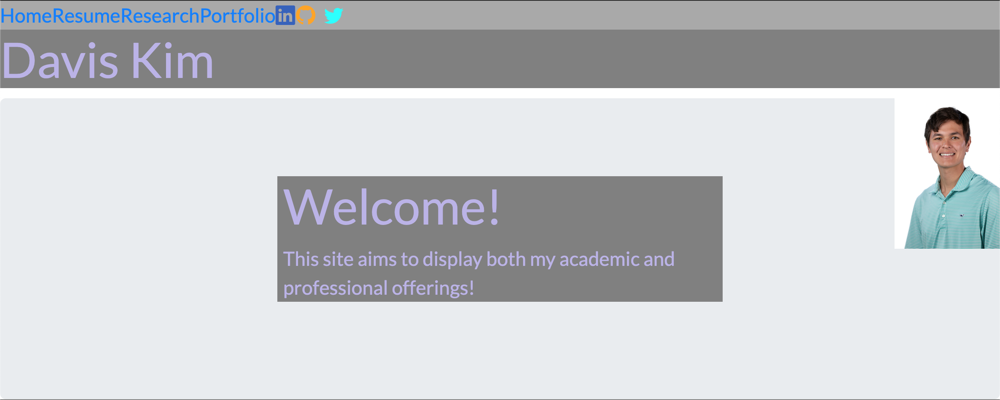

# Portfolio-2
This is an updated portfolio that includes useful contact links, links to class assignments, and updated work

---

## **Table of Contents**

1. [Links](#Links)
2. [Technologies Used](#Technologies-Used)

---

## **Links**

[Deployed application](https://dkim525.github.io/Portfolio-2/)\
[GitHub repository](https://github.com/dkim525/Portfolio-2)

---
## **Technologies Used**

* HTML
* CSS
* Bootstrap